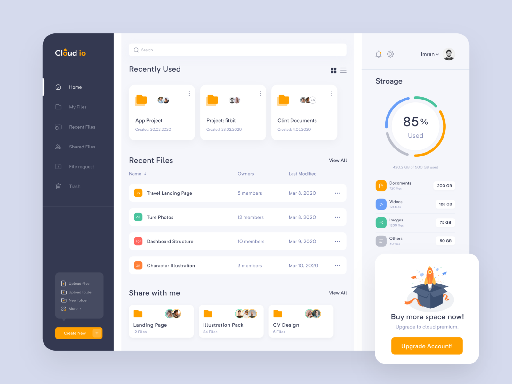

# CSS Layout Challenge

We're building this layout by [Imran🏀 on Dribbble](https://dribbble.com/shots/10747116-Cloud-Web-App):

[Sign up for the challenge here](https://daveceddia.com/css-layout-challenge/) and work through building the solution (get as far as you can) by Wednesday 3/25, and on Wednesday I'll do a livestream working through it together.

This repo will have a solution posted once the challenge is over, and a link to the livestream.

We're using [**Issues**](issues) on this repo as our little community forum. Post progress and questions there!

## Resources

Some things I found helpful as I was working through this:

* [The original design by Imran on Dribbble](https://dribbble.com/shots/10747116-Cloud-Web-App) (note: not my design!)
* [CSS Grid Garden](https://cssgridgarden.com/) because I'm still learning CSS grid
* [CSS Tricks: Complete Guide to CSS Grid](https://css-tricks.com/snippets/css/complete-guide-grid/) because same
* [This snippet of code for an sr-only class](https://a11y-guidelines.orange.com/web_EN/exemples/masquage/index.html) to make content only visible to screen readers
* [Every Layout](https://every-layout.dev/) with good ideas on how to make resilient CSS layouts
* [Feather Icons](https://feathericons.com/) - free icon set with adjustable color/size/stroke, single-click-to-download icons as needed
* [This CSS filter generator](https://codepen.io/sosuke/pen/Pjoqqp) if you want to recolor an SVG without pasting the SVG itself into the document (or, easier: recolor the icons in Feather before downloading!)

